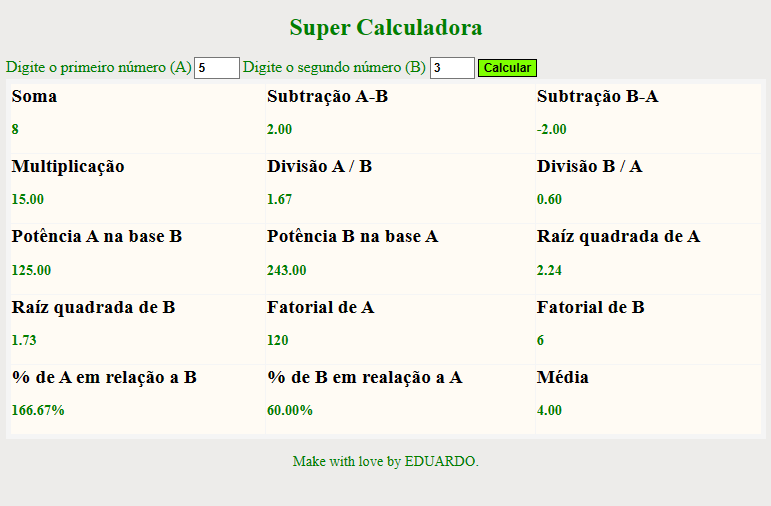

# Sobre o Projeto
### Projeto realizado como desáfio do Minicamp da XP para memorização de DOM e funções. Através dos inputs podemos realizar diversos cáculos matemáticos.

## Tecnologias Utilizadas:  
## Front-end:  
### Html  
### CSS  
### JavaScript  